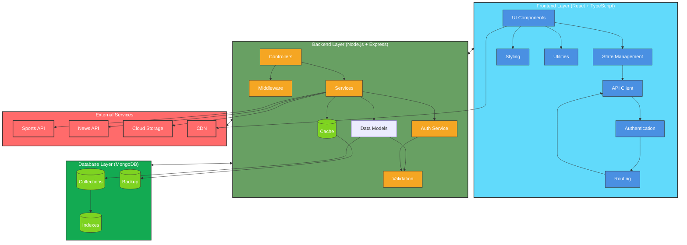

# 🏆 Sports Updates Portal

A comprehensive sports news and updates platform built with modern web technologies.

## 🛠️ Technologies Used

### Frontend
- **React.js** - UI library for building interactive user interfaces
- **TypeScript** - Type-safe JavaScript for better development experience
- **Tailwind CSS** - Utility-first CSS framework for rapid UI development
- **React Router** - Client-side routing
- **Axios** - HTTP client for API requests
- **React Query** - Data fetching and caching
- **Framer Motion** - Animation library for smooth transitions

### Backend
- **Node.js** - JavaScript runtime
- **Express.js** - Web application framework
- **TypeScript** - Type-safe JavaScript
- **MongoDB** - NoSQL database
- **Mongoose** - MongoDB object modeling
- **JWT** - Authentication and authorization
- **Bcrypt** - Password hashing
- **Cors** - Cross-origin resource sharing
- **Dotenv** - Environment variable management

### Development Tools
- **ESLint** - Code linting
- **Prettier** - Code formatting
- **Nodemon** - Development server with auto-reload
- **Concurrently** - Run multiple commands concurrently
- **TypeScript** - Static type checking

## 📋 Features

### User Features
- 📰 Real-time sports news updates
- 🏆 Live match scores and statistics
- 📊 Team and player statistics
- 📱 Responsive design for all devices
- 🔍 Advanced search functionality
- 🔔 Personalized notifications
- 👤 User authentication and profiles
- 💬 Interactive comments and discussions

### Admin Features
- 📝 Content management system
- 📊 Analytics dashboard
- 👥 User management
- 🔧 System configuration
- 📈 Performance monitoring

## 🏗️ Architecture



### Architecture Components

#### Frontend Layer
- **UI Components**: Reusable React components for consistent user interface
- **State Management**: Global state management using React Query
- **API Client**: Axios-based HTTP client for API communication
- **Authentication**: JWT-based authentication and authorization
- **Routing**: Client-side routing with React Router
- **Styling**: Tailwind CSS for responsive design
- **Utilities**: Helper functions and custom hooks

#### Backend Layer
- **Controllers**: Request handlers and business logic
- **Services**: Core business logic and external service integration
- **Models**: MongoDB schema definitions and data models
- **Middleware**: Request processing and validation
- **Auth Service**: User authentication and authorization
- **Cache Service**: Redis-based caching for performance
- **Validation**: Request and data validation

#### Database Layer
- **Collections**: MongoDB collections for data storage
- **Indexes**: Optimized database indexes
- **Cache**: Redis cache for frequently accessed data
- **Backup**: Automated database backups

#### External Services
- **Sports API**: Real-time sports data integration
- **News API**: Sports news and updates
- **Cloud Storage**: Media and file storage
- **CDN**: Content delivery network for static assets

### Data Flow
1. User interactions trigger API requests through the Frontend Layer
2. Requests are processed by the Backend Layer's Controllers
3. Business logic is handled by Services
4. Data is stored/retrieved from the Database Layer
5. External services provide additional data and functionality
6. Responses flow back through the layers to update the UI

## 🚀 Getting Started

### Prerequisites
- Node.js (v18 or higher)
- MongoDB (v6 or higher)
- npm or yarn package manager

### Installation

1. Clone the repository:
```bash
git clone https://github.com/yourusername/sports-updates.git
cd sports-updates
```

2. Install dependencies:
```bash
# Install root dependencies
npm install

# Install frontend dependencies
cd frontend
npm install

# Install backend dependencies
cd ../backend
npm install
```

3. Set up environment variables:
```bash
# In the root directory
cp .env.example .env

# In the backend directory
cd backend
cp .env.example .env
```

4. Configure environment variables:
```env
# Root .env
PORT=3000
NODE_ENV=development

# Backend .env
PORT=5000
MONGODB_URI=mongodb://localhost:27017/sports-updates
JWT_SECRET=your_jwt_secret
```

### Development

1. Start the development servers:
```bash
# From the root directory
npm run dev
```

This will start:
- Frontend on http://localhost:3000
- Backend on http://localhost:5000

2. Access the application:
- Frontend: http://localhost:3000
- Backend API: http://localhost:5000/api
- API Documentation: http://localhost:5000/api-docs

## 📁 Project Structure

```
sports-updates/
├── frontend/                 # React frontend application
│   ├── public/              # Static files
│   ├── src/                 # Source files
│   │   ├── components/      # Reusable components
│   │   ├── pages/          # Page components
│   │   ├── hooks/          # Custom React hooks
│   │   ├── services/       # API services
│   │   ├── utils/          # Utility functions
│   │   ├── types/          # TypeScript types
│   │   └── styles/         # Global styles
│   └── package.json        # Frontend dependencies
│
├── backend/                 # Node.js backend application
│   ├── src/                # Source files
│   │   ├── controllers/    # Route controllers
│   │   ├── models/         # Database models
│   │   ├── routes/         # API routes
│   │   ├── services/       # Business logic
│   │   ├── middleware/     # Custom middleware
│   │   ├── utils/          # Utility functions
│   │   └── types/          # TypeScript types
│   └── package.json        # Backend dependencies
│
└── package.json            # Root package.json
```

## 🧪 Testing

### Frontend Tests
```bash
cd frontend
npm test
```

### Backend Tests
```bash
cd backend
npm test
```

## 📦 Deployment

### Frontend Deployment
1. Build the frontend:
```bash
cd frontend
npm run build
```

2. Deploy to your hosting service (e.g., Vercel, Netlify)

### Backend Deployment
1. Build the backend:
```bash
cd backend
npm run build
```

2. Deploy to your hosting service (e.g., Heroku, DigitalOcean)

## 🤝 Contributing

1. Fork the repository
2. Create your feature branch (`git checkout -b feature/AmazingFeature`)
3. Commit your changes (`git commit -m 'Add some AmazingFeature'`)
4. Push to the branch (`git push origin feature/AmazingFeature`)
5. Open a Pull Request

## 📝 License

This project is licensed under the MIT License - see the [LICENSE](LICENSE) file for details.

## 👥 Authors

- Your Name - Initial work - [YourGitHub](https://github.com/yourusername)

## 🙏 Acknowledgments

- Thanks to all contributors
- Inspired by various sports news platforms
- Built with modern web technologies 