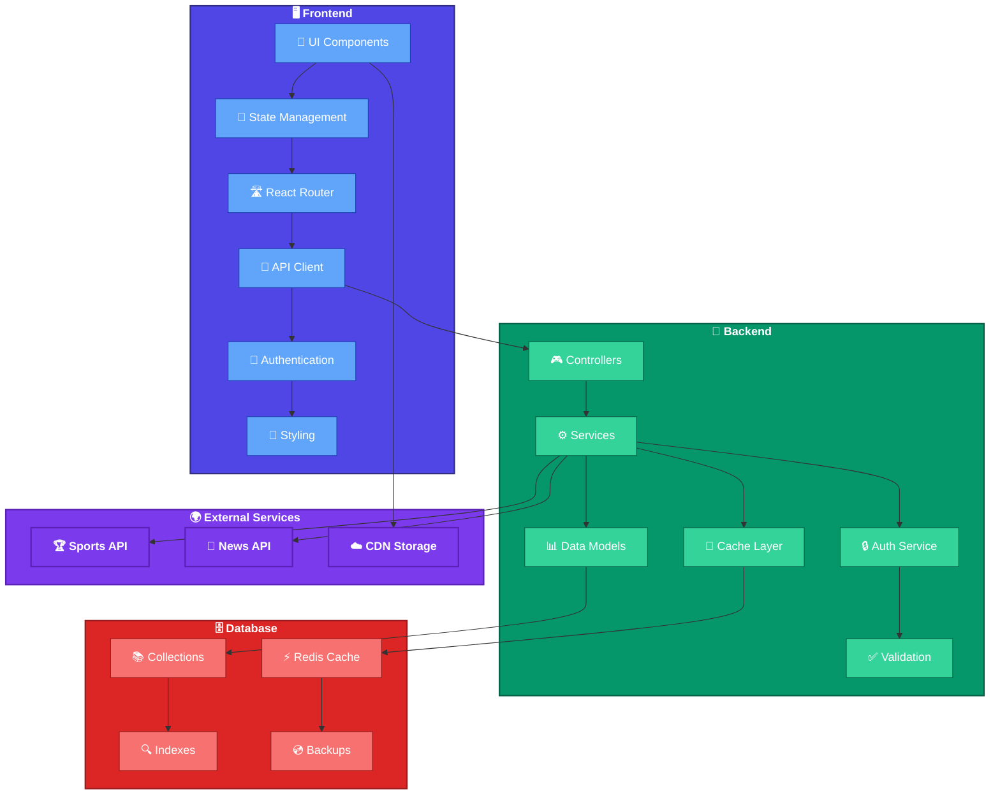

# 🏆 Sports Updates Portal

A **modern, real-time sports news and updates platform** powered by cutting-edge technologies.

[](LICENSE)


---

## 🌐 Live Features

✅ Real-time news  
✅ Live scores & statistics  
✅ Authentication & profiles  
✅ Admin dashboard  
✅ Mobile responsive  
✅ API integration  

---

## 🧰 Tech Stack

### 🖥️ Frontend
> Built with **React**, styled with **Tailwind CSS**, and animated using **Framer Motion**.

- ⚛️ **React.js**
- 🧠 **TypeScript**
- 🎨 **Tailwind CSS**
- 🔁 **React Router**
- 📦 **Axios**
- ⚡ **React Query**
- 🎞 **Framer Motion**

### 🛠️ Backend
> Built with **Node.js**, secured with **JWT**, and powered by **MongoDB**.

- 🚀 **Node.js**, **Express.js**
- 🧠 **TypeScript**
- 🛢️ **MongoDB**, **Mongoose**
- 🔐 **JWT**, **Bcrypt**
- 🌐 **CORS**, **Dotenv**

### ⚙️ Dev Tools
- 🧹 **ESLint**, **Prettier**
- 🔁 **Nodemon**, **Concurrently**
- 📦 **TypeScript**

---

## 🎯 Key Features

### 👤 User
- 📰 Real-time sports news
- 📺 Live match scores & statistics
- 📊 Player & team analytics
- 🔍 Smart search
- 🔔 Notifications
- 💬 Commenting system

### 🛡️ Admin
- 📝 CMS for content updates
- 📈 Analytics dashboard
- 👥 Manage users
- ⚙️ System configuration
- 🔍 Performance monitoring

---

## 🏗️ System Architecture



> **Flow**: Frontend sends requests ➜ Backend processes via services ➜ Database fetch ➜ Data returned ➜ UI update

---

## 🚀 Getting Started

### ⚙️ Prerequisites

* ✅ Docker and Docker Compose
* ✅ Node.js v18+
* ✅ MongoDB v6+
* ✅ npm or yarn

### 📦 Installation

```bash
git clone https://github.com/yourusername/sports-updates.git
cd sports-updates
npm install
```

#### Setup Frontend & Backend

```bash
cd frontend && npm install
cd ../backend && npm install
```

### 🔑 Environment Variables

```bash
# .env (root)
PORT=3000

# .env (backend)
PORT=5000
MONGODB_URI=mongodb://localhost:27017/sports-updates
JWT_SECRET=your_jwt_secret
```

---

## 💻 Project Structure

```bash
sports-updates/
├── frontend/                 # React App
│   ├── components/          # UI Components
│   ├── pages/               # Views
│   ├── services/            # API Services
│   └── hooks/, styles/, etc
├── backend/                 # Node + Express App
│   ├── controllers/         # API Controllers
│   ├── services/            # Business Logic
│   ├── models/              # DB Models
│   └── middleware/, routes/
└── package.json             # Project config
```

---

## 🧪 Testing

```bash
# Frontend Tests
cd frontend
npm test

# Backend Tests
cd backend
npm test
```

---

## ☁️ Deployment

### Frontend (e.g. Netlify, Vercel)

```bash
cd frontend
npm run build
```

### Backend (e.g. Heroku, Render)

```bash
cd backend
npm run build
```

---

## 🤝 Contributing

```bash
git checkout -b feature/myFeature
git commit -m "Add myFeature"
git push origin feature/myFeature
```

📬 Pull Requests are welcome!

---

## 📜 License

Licensed under the MIT License. See [`LICENSE`](./LICENSE) for more details.

---

## 👨‍💻 Author

**Your Name** — [GitHub](https://github.com/yourusername)

---

## 🙏 Acknowledgements

* Inspired by ESPN, LiveScore, and other sports platforms
* Built with ❤️ using modern tech 