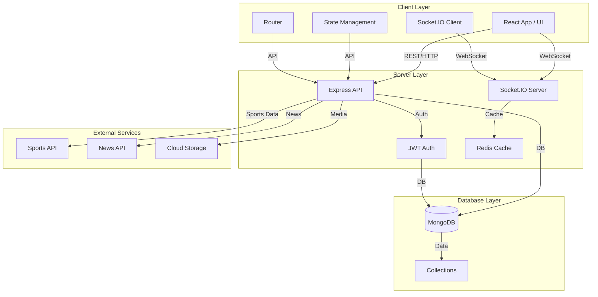

#  Sports Updates

<div align="center">
  
  <a href="https://github.com/MalikShoaibAhmadKhan/sports-app/stargazers"></a>
  <a href="https://github.com/MalikShoaibAhmadKhan/sports-app/network/members"></a>
  <a href="https://github.com/MalikShoaibAhmadKhan/sports-app/issues"></a>
  <a href="https://github.com/MalikShoaibAhmadKhan/sports-app/blob/main/LICENSE"></a>
  <br/>
  <br/>
  <b>A modern, real-time sports information platform built with cutting-edge technologies.</b>
</div>

---

> **Live scores, news, and stats for every sports fan.**

---

## 📖 Table of Contents
- [Demo](#-demo)
- [Features](#-features)
- [Tech Stack](#-tech-stack)
- [Architecture](#-application-architecture)
- [Getting Started](#-getting-started)
- [Project Structure](#-project-structure)
- [Configuration](#-configuration)
- [Testing](#-testing)
- [Deployment](#-deployment)
- [Contributing](#-contributing)
- [License](#-license)
- [Authors](#-authors)
- [Acknowledgments](#-acknowledgments)

---

## 🎬 Demo

> _"A picture is worth a thousand words!"_


---

## 🌟 Features

- ⚡ **Live Scores:** Real-time match updates, stats, and commentary
- 📰 **Latest News:** Breaking news, trending stories, and personalized feeds
- 👤 **User Profiles:** Favorite teams, notifications, and dashboards
- 🎨 **Modern UI/UX:** Responsive, dark/light mode, smooth animations

---

## 🛠️ Tech Stack

**Frontend:**
-  React 18
-  TypeScript
-  Chakra UI
- React Router, Socket.IO Client, Axios

**Backend:**
-  Node.js
- Express, MongoDB, Socket.IO, JWT, TypeScript

---

## 🏗️ Application Architecture

> **A robust, scalable, and real-time 3-tier architecture.**



**Legend:**
- **Client Layer:** User interface, state, routing, and real-time client
- **Server Layer:** API, authentication, real-time server, caching
- **Database Layer:** MongoDB and collections (users, matches, news, stats)
- **External Services:** Sports/News APIs, cloud storage

**How Data Flows:**
1. User interacts with the React UI (Client Layer)
2. API requests and WebSocket events are sent to the Server Layer
3. Server processes requests, authenticates, fetches or updates data in MongoDB, and may cache results
4. Server fetches live data from external APIs as needed
5. Real-time updates are pushed to the client via Socket.IO

---

## 🚀 Getting Started

<details>
<summary>Show setup instructions</summary>

### Prerequisites
- Node.js (v18 or higher)
- npm (v9 or higher)
- MongoDB (v6.0 or higher)

### Installation
```bash
git clone https://github.com/MalikShoaibAhmadKhan/sports-app.git
cd sports-app
```

```bash
# Backend
cd server
npm install
cp .env.example .env
# Edit .env as needed
npm run dev
```

```bash
# Frontend
cd ../client
npm install
npm start
```

</details>

---

## 📁 Project Structure

```text
sports-app/
├── client/                 # Frontend React application
│   ├── public/            # Static files
│   └── src/               # Source files
│       ├── components/    # Reusable components
│       ├── pages/         # Page components
│       ├── hooks/         # Custom hooks
│       ├── services/      # API services
│       └── utils/         # Utility functions
│
└── server/                # Backend Node.js application
    ├── src/              # Source files
    │   ├── controllers/  # Route controllers
    │   ├── models/       # Database models
    │   ├── routes/       # API routes
    │   ├── services/     # Business logic
    │   └── utils/        # Utility functions
    └── tests/            # Test files
```

---

## 🔧 Configuration

### Environment Variables

#### Backend (.env)
```env
PORT=5000
MONGODB_URI=mongodb://localhost:27017/sports-updates
JWT_SECRET=your_jwt_secret
NODE_ENV=development
```

#### Frontend (.env)
```env
REACT_APP_API_URL=http://localhost:5000
REACT_APP_SOCKET_URL=http://localhost:5000
```

---

## 🧪 Testing

```bash
# Run backend tests
cd server
npm test

# Run frontend tests
cd client
npm test
```

---

## 📦 Deployment

### Backend
```bash
cd server
npm run build
npm start
```

### Frontend
```bash
cd client
npm run build
# Deploy the build/ directory to your hosting service
```

---

## 🤝 Contributing

1. Fork the repository
2. Create your feature branch (`git checkout -b feature/AmazingFeature`)
3. Commit your changes (`git commit -m 'Add some AmazingFeature'`)
4. Push to the branch (`git push origin feature/AmazingFeature`)
5. Open a Pull Request

---

## 📝 License

This project is licensed under the MIT License - see the [LICENSE](LICENSE) file for details.

---

## 👥 Authors

- Malik Shoaib Ahmad Khan - [MalikShoaibAhmadKhan](https://github.com/MalikShoaibAhmadKhan)

---

## 🙏 Acknowledgments

- [Unsplash](https://unsplash.com/) for the beautiful images
- [Chakra UI](https://chakra-ui.com/) for the amazing component library
- All contributors who have helped shape this project

---

<div align="center">
Made with ❤️ by Malik Shoaib Ahmad Khan
</div> 