# 🏆 Sports Updates - Real-time Sports Information Platform

<div align="center">


[](https://reactjs.org/)
[](https://www.typescriptlang.org/)
[](https://chakra-ui.com/)
[](https://nodejs.org/)
[](https://www.mongodb.com/)
[](https://socket.io/)

A modern, real-time sports information platform built with cutting-edge technologies.

</div>

## 🌟 Features

### 🎯 Live Scores
- Real-time match updates across multiple sports
- Detailed match statistics and analysis
- Live commentary and key events
- Match timeline and player performance metrics

### 📰 Latest News
- Breaking sports news and updates
- Category-wise news filtering
- Featured articles and trending stories
- Personalized news feed based on user preferences

### 👤 User Profile
- Personalized dashboard
- Favorite teams and sports tracking
- Customizable notifications
- Match reminders and alerts

### 🎨 Modern UI/UX
- Responsive design for all devices
- Dark/Light mode support
- Smooth animations and transitions
- Intuitive navigation

## 🛠️ Tech Stack

### Frontend
- **React 18** - Modern UI library
- **TypeScript** - Type-safe JavaScript
- **Chakra UI** - Component library
- **React Router** - Client-side routing
- **Socket.IO Client** - Real-time updates
- **Axios** - HTTP client

### Backend
- **Node.js** - Runtime environment
- **Express** - Web framework
- **MongoDB** - Database
- **Socket.IO** - Real-time communication
- **JWT** - Authentication
- **TypeScript** - Type safety

## 🏗️ Application Architecture

```mermaid
graph TB
    subgraph Client["🌐 Client Layer"]
        UI[React Components]
        State[State Management]
        Router[React Router]
        Socket[Socket.IO Client]
    end

    subgraph Server["⚙️ Server Layer"]
        API[Express API]
        Auth[JWT Auth]
        SocketServer[Socket.IO Server]
        Cache[Redis Cache]
    end

    subgraph Database["💾 Database Layer"]
        MongoDB[(MongoDB)]
        Collections[Collections]
    end

    subgraph External["🌍 External Services"]
        SportsAPI[Sports API]
        NewsAPI[News API]
        CloudStorage[Cloud Storage]
    end

    %% Client to Server connections
    UI --> API
    UI --> SocketServer
    State --> API
    Router --> API
    Socket --> SocketServer

    %% Server to Database connections
    API --> Auth
    API --> MongoDB
    SocketServer --> Cache
    Auth --> MongoDB

    %% Server to External Services
    API --> SportsAPI
    API --> NewsAPI
    API --> CloudStorage

    %% Database structure
    MongoDB --> Collections

    %% Styling
    classDef client fill:#f9f,stroke:#333,stroke-width:2px
    classDef server fill:#bbf,stroke:#333,stroke-width:2px
    classDef database fill:#dfd,stroke:#333,stroke-width:2px
    classDef external fill:#fdd,stroke:#333,stroke-width:2px

    class Client client
    class Server server
    class Database database
    class External external
```



### Architecture Components

#### Client Layer
- **React Components**: UI components built with Chakra UI
- **State Management**: Local and global state handling
- **React Router**: Client-side routing and navigation
- **Socket.IO Client**: Real-time updates and notifications

#### Server Layer
- **Express API**: RESTful API endpoints
- **JWT Auth**: Authentication and authorization
- **Socket.IO Server**: Real-time communication server
- **Redis Cache**: Performance optimization and session management

#### Database Layer
- **MongoDB**: Primary database
- **Collections**: Organized data structures
  - Users
  - Matches
  - News
  - Statistics

#### External Services
- **Sports API**: Live scores and match data
- **News API**: Sports news and updates
- **Cloud Storage**: Media and file storage

## 🚀 Getting Started

### Prerequisites
- Node.js (v18 or higher)
- npm (v9 or higher)
- MongoDB (v6.0 or higher)

### Installation

1. Clone the repository:
```bash
git clone https://github.com/yourusername/sports-updates.git
cd sports-updates
```

2. Install dependencies:
```bash
# Install backend dependencies
cd server
npm install

# Install frontend dependencies
cd ../client
npm install
```

3. Set up environment variables:
```bash
# In server directory
cp .env.example .env
# Edit .env with your configuration
```

4. Start the development servers:
```bash
# Start backend server (from server directory)
npm run dev

# Start frontend server (from client directory)
npm start
```

The application will be available at:
- Frontend: http://localhost:3001
- Backend: http://localhost:5000

## 📁 Project Structure

```
sports-updates/
├── client/                 # Frontend React application
│   ├── public/            # Static files
│   └── src/               # Source files
│       ├── components/    # Reusable components
│       ├── pages/         # Page components
│       ├── hooks/         # Custom hooks
│       ├── services/      # API services
│       └── utils/         # Utility functions
│
└── server/                # Backend Node.js application
    ├── src/              # Source files
    │   ├── controllers/  # Route controllers
    │   ├── models/       # Database models
    │   ├── routes/       # API routes
    │   ├── services/     # Business logic
    │   └── utils/        # Utility functions
    └── tests/            # Test files
```

## 🔧 Configuration

### Environment Variables

#### Backend (.env)
```env
PORT=5000
MONGODB_URI=mongodb://localhost:27017/sports-updates
JWT_SECRET=your_jwt_secret
NODE_ENV=development
```

#### Frontend (.env)
```env
REACT_APP_API_URL=http://localhost:5000
REACT_APP_SOCKET_URL=http://localhost:5000
```

## 🧪 Testing

```bash
# Run backend tests
cd server
npm test

# Run frontend tests
cd client
npm test
```

## 📦 Deployment

### Backend Deployment
1. Build the TypeScript code:
```bash
cd server
npm run build
```

2. Start the production server:
```bash
npm start
```

### Frontend Deployment
1. Build the React application:
```bash
cd client
npm run build
```

2. Deploy the `build` directory to your hosting service.

## 🤝 Contributing

1. Fork the repository
2. Create your feature branch (`git checkout -b feature/AmazingFeature`)
3. Commit your changes (`git commit -m 'Add some AmazingFeature'`)
4. Push to the branch (`git push origin feature/AmazingFeature`)
5. Open a Pull Request

## 📝 License

This project is licensed under the MIT License - see the [LICENSE](LICENSE) file for details.

## 👥 Authors

- Your Name - Initial work - [YourGitHub](https://github.com/yourusername)

## 🙏 Acknowledgments

- [Unsplash](https://unsplash.com/) for the beautiful images
- [Chakra UI](https://chakra-ui.com/) for the amazing component library
- All contributors who have helped shape this project

---

<div align="center">
Made with ❤️ by [Your Name]
</div> 